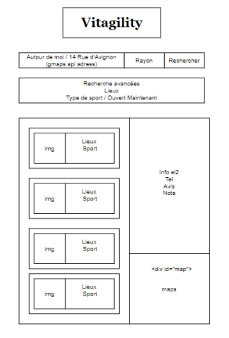

# Practice agility
Mise en pratique de l'agilité dans le cadre d'un enseignement de 3 jours à l'université de Calais pour des étudiants en 3ème année de licence.

Toutes les informations nécessaires sont décrites dans les documents suivant:
- Les [objectifs](1_Objectifs.md) de ce TP
- L'[organisation](2_Organisation.md) des équipes, le planning, les Livrables
- La [description des besoins](3_Besoin.md) aux quels les équipes vont devoir répondre

---
# Vitagility | Huyghes Antoine, Pecqueux Théo, Skibinski Pierre, Wallet Nicolas 

## [VitAgility site officiel](https://vitagility.herokuapp.com/)
---
**WARNING** : il est nécéssaire d'importer une clé API GoogleMaps pour utiliser le projet en local
```bash
export GOOGLE_MAPS_API_KEY="YOUR_KEY"
```
Il faut ensuite installer les packages nécéssaire et lancer le serveur
```bash
cd src
npm i && npm run dev
```

Pour effectuer les tests cypress qui sont présent dans le projet
```bash
npm run cypress:open
```
Une interface graphique Cypress va s'ouvrir pour que vous puissiez effectuer les tests sur votre navigateur

---

## Compte rendu journalier: 

### [Lien du repo](https://www.gitlab.com/huyghes-antoine/vitagility)


* **06/01 :** 
    * **SPRINT 1**
        * Choix du sujet : **1** 
        * Maquette du site 

        

        * Activer la géolocalisation

    * **SPRINT 2**
        
        * Nous allons utiliser l'API de **Décathlon** SportsPlaces pour récupèrer les lieux sportifs. 
        * Nous voulions utiliser l'API **Google Map** pour avoir la latitude et longitude d'une adresse voulue, mais elle n'est pas publique. Donc nous nous réorientons vers l'API de **PoisitionStack**
        * Nous avons réussis à récupérer les lieux présents dans l'API décathlon et les reformer dans notre propre API à l'adresse http://localhost:3000/api/places/latitude&longitude&radius" 
            * Latitude : latitude du lieu souhaité 
            * Longitute : longitutde du lieu souhaité
            * Radius : rayon de la zone de recherche

* **07/01 :** 

    * **SPRINT 3**
        * Au final nous avons trouvé un moyen d'utiliser l'API de google maps, il fallait ajouter un moyen de paiement pour pouvoir en profiter. 
        * Nous avons afficher les résultats des recherches sous forme d'élement sur la page web. Avec une limite de 10 lieux par recherche. 
        * Ajout de l'API google map pour avoir une prévisualisation de la carte du lieu de la géolocalisation, et des lieux sélectionnés. 
        * Mise en place de l'intégration continue par le biais du fichier .yml

    * **SPRINT 4**
        * Mise en place des tests avec l'outil Cypress. 
        * Refonte du design pour coller au design de décathlon 
        * Mise en place de l'ajout d'adresse complète lors des recherches de lieux. Ex: recherche "calais"  ->  "Calais, France" grâce à l'API de google maps. 

* **08/01 :** 

    * **SPRINT 5**
        * Déploiement continue sur Heroku grâce au ci/cd 
        * Mise à jour du design de la page pour coller à l'ésprit Décathlon 
        * Ajout de tests cypress sur l'API 
        * Recherche avancée avec filtre sur le sport pour affiner les recherches

    * **SPRINT 6**
        * Mise en place d'un outil de prévisualisation de qualité de code (**ESLint**) 
        * Modification design et ajout du magasins décathlon le plus proche de la localisation
        * Ajout des derniers tests cypress 
        * Release 1.0 du projet 
